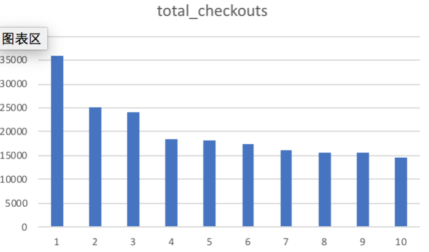
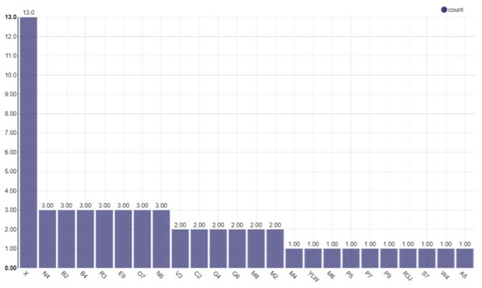
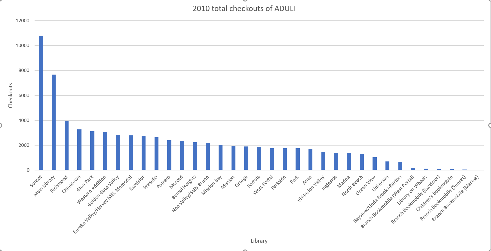
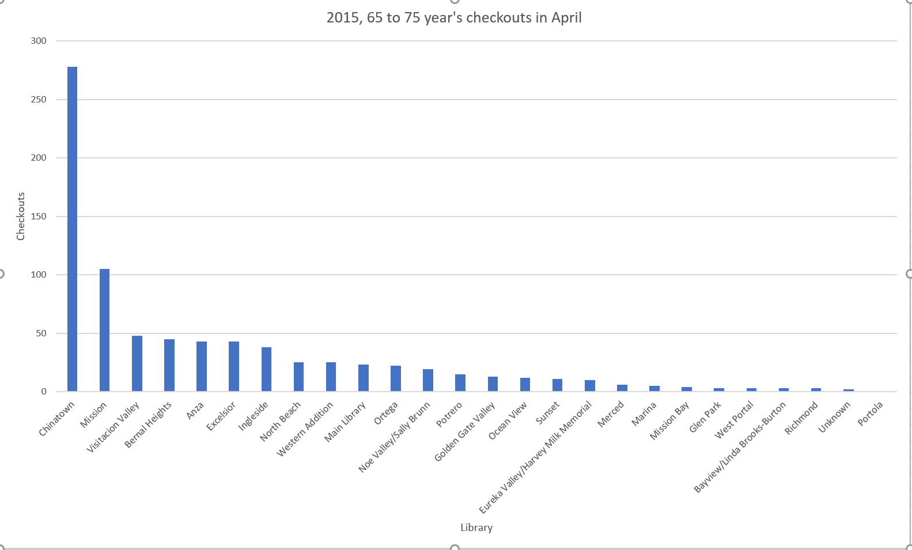
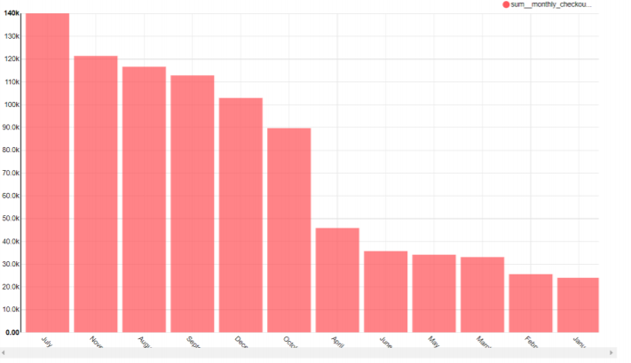
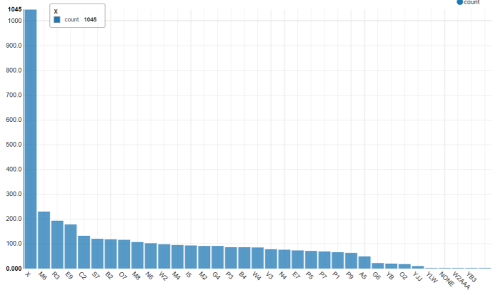

# Checkpoint3


Description


Question 1:
What are the top 10 total checkouts?
```sql
select count(*)
total_checkouts
from datasets.library_usage
where total_checkouts < 10
group by "total_checkouts"
order by total_checkouts DESC
```



Question 2:
How many library had 100 Total checkouts in Feb,2015?
```sql
select count(*) home_library_code
from datasets.library_usage
where total_checkouts = 100 and circulation_active_year = 2015
and circulation_active_month = 2
```


Question 3:
How many email was FALSE in 2016 in each library?
```sql
SELECT home_library_code
From datasets.library_usage
WHERE notice_preference_definition = 'email'
And provided_email_address = 'FALSE'
And circulation_active_year = '2016'
```



Question 4: 
How many people registered in 2016?
```sql
select Year_Patron_Registered,
count (*) as Total_People
FROM datasets.library_usage
WHERE Year_Patron_Registered = 2016
GROUP BY Year_Patron_Registered
```


Question 5:
Which library had the most ADULT Total Checkouts in 2010?
```sql
select Year_Patron_Registered,
Home_Library_Definition,
max(total_checkouts) AS Total_Checkouts_Number
FROM datasets.library_usage
WHERE Patron_Type_Definition = 'ADULT' AND Year_Patron_Registered = 2010
GROUP BY Home_Library_Definition, Year_Patron_Registered
ORDER BY Total_Checkouts_Number DESC
```



Question 6: 
Which library had the most 65 to 74 years' checkouts in April, 2015?
```sql
select Year_Patron_Registered,
Home_Library_Definition,
max(total_checkouts) AS Total_Checkouts_Number
FROM datasets.library_usage
WHERE age_range = '65 to 74 years' AND Year_Patron_Registered = 2015 AND
circulation_active_month = 'April'
GROUP BY Home_Library_Definition, Year_Patron_Registered
ORDER BY Total_Checkouts_Number DESC
```



Question 7: 
Which month did Main library had the most Total Checkouts in 2013?
```sql
SELECT circulation_active_month,
SUM(total_checkouts) as monthly_checkouts
FROM datasets.library_usage
WHERE home_library_definition = 'Main Library'and circulation_active_year = 2013
GROUP by circulation_active_month
ORDER By monthly_checkouts DESC
```



Question 8: 
What is the average Total Checkouts of Chinatown library in Jan, 2016?
```sql
SELECT
Avg (total_checkouts) as Total_Checkouts
FROM datasets.library_usage
WHERE home_library_definition = 'Chinatown Library' and circulation_active_year = 2016
```


Question 9:
Which library has the most Total Renewal?
```sql
select count(*)
FROM datasets.library_usage
group by "total_renewals"
order by total_renewals DESC
```


Question 10:
```sql
How many times each Library had less than 10 total renewals in July 2014?
SELECT home_library_code
from datasets.library_usage
WHERE total_renewals < 10
And circulation_active_month = 'July'
And circulation_active_year = '2014'
```


